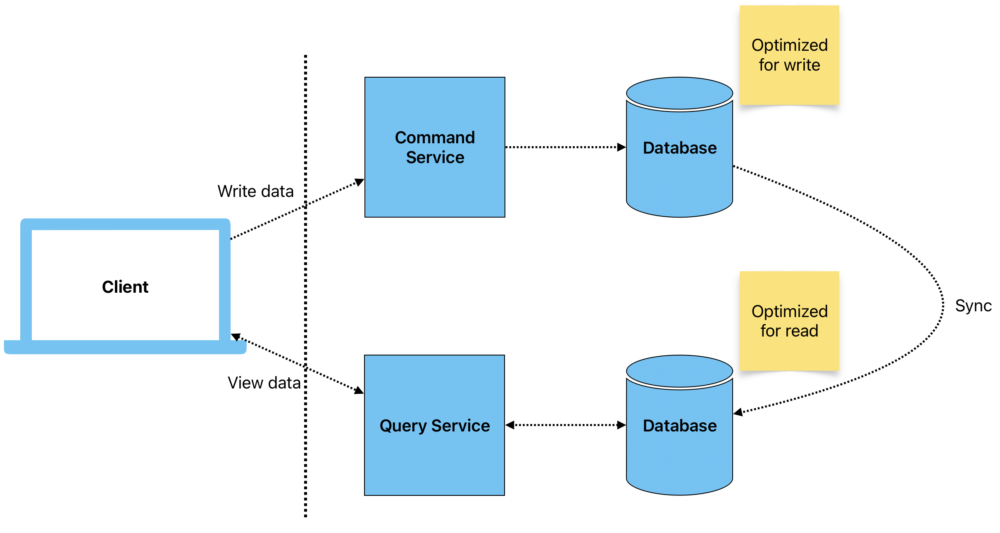

# CQRS

## Overview

**Command Query Responsibility Segregation (CQRS)** is a design pattern that separates the responsibilities of reading and writing data in a system. In CQRS, the **Command** model handles operations that modify data (create, update, delete), while the **Query** model focuses on retrieving data without making any modifications. This segregation enhances scalability, flexibility, and performance, making it a good fit for **Event-Driven Architecture (EDA)** systems where data processing is often distributed and asynchronous.

### Key Concepts

- **Command**: Operations that modify the system’s state, such as adding a new customer or updating an order. Commands are typically processed asynchronously in an EDA system.

- **Query**: Operations that retrieve data without altering the state, such as fetching a list of orders or customer details.

- **Event**: In CQRS, after a command modifies the system's state, an event is generated to notify interested components of the change.

- **Event Handler**: Listens to events and reacts accordingly (e.g., updating a read model or notifying external services).

- **Read and Write Models**: The system has distinct data models for reading and writing. The **Write Model** is optimized for commands (e.g., handling complex business rules), while the **Read Model** is optimized for queries (e.g., fast lookups, caching).

## Common Use Cases

1. **E-commerce Systems**: In an online store, CQRS separates inventory management (commands) from product catalog queries. Customers querying product availability use the read model, while orders and stock updates modify the write model.

2. **Financial Systems**: CQRS is beneficial in banking or trading systems, where transactional operations (commands) must be strictly handled, while queries for account balances or transaction histories need to be optimized for performance.

3. **Real-Time Analytics**: In applications requiring heavy data querying, like dashboards or analytics systems, CQRS allows the query side to be optimized separately from the write operations, enabling faster read performance.

## Pros

- **Separation of Concerns**: By splitting reads and writes, the system can optimize each side independently, leading to better performance and maintainability.

- **Scalability**: The write model can be scaled separately from the read model, allowing systems to handle high write throughput while keeping queries performant.

- **Asynchronous Processing**: In EDA, CQRS fits naturally as events are processed asynchronously. After a command is executed, an event can trigger updates to the read model.

- **Flexibility**: Allows for independent evolution of the read and write models. New features or reports can be added by extending the read model without changing the command logic.

- **Optimized Query Performance**: The read model can be tailored for specific querying needs, such as creating materialized views or caching frequently accessed data.

## Cons

- **Increased Complexity**: Implementing separate models for reads and writes can introduce architectural complexity. This also applies to keeping read and write models consistent.

- **Eventual Consistency**: Since the system handles commands and queries asynchronously, there might be a delay between when data is written and when the query model reflects those changes, leading to temporary inconsistencies.

- **Data Duplication**: Maintaining separate models for reads and writes often leads to data duplication, which requires careful management of storage and synchronization.

- **Complex Event Flow**: In an EDA system, the flow of events can become difficult to trace, especially as the number of event handlers and models grow, making debugging and monitoring more challenging.

## Example Workflow

1. **Command**: A customer submits an order on an e-commerce platform. This command triggers the **OrderService** to validate and process the order.

2. **Event Generation**: Once the order is successfully created, an "Order Placed" event is generated and published to the event broker.

3. **Event Handling**:
    - The **InventoryService** listens to the event to update stock levels.
    - The **ShippingService** prepares the delivery.
    - The **OrderReadModel** is updated to reflect the latest order information, making it available for future queries.

4. **Query**: When the customer requests their order status, the **OrderReadModel** responds with the current state, which may be optimized for fast lookup (e.g., using a cache or materialized view).

## Conclusion

The **CQRS Pattern** fits well within **Event-Driven Architectures** as it promotes decoupling and asynchronous processing, enabling systems to scale and perform optimally. However, its use adds complexity and demands careful handling of data consistency and event flow. For systems requiring high scalability and performance, particularly in scenarios with distinct read and write requirements, CQRS provides a powerful architectural solution.
