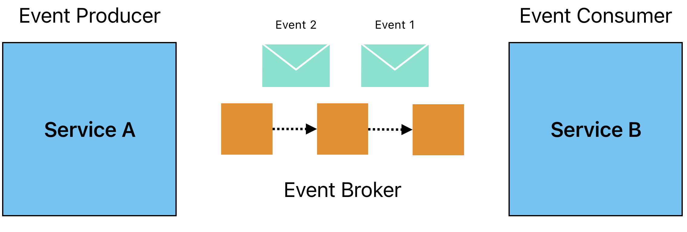
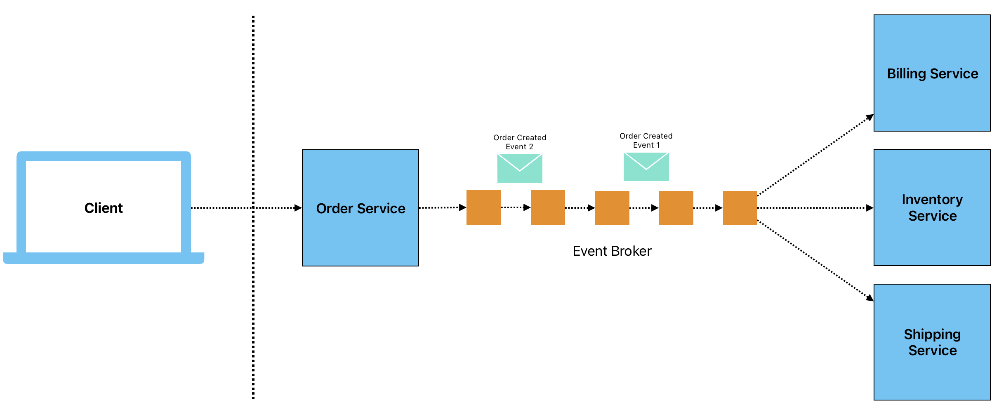

# Event Driven Architecture

## Overview

**Event-Driven Architecture (EDA)** is a design paradigm where system components interact through the production and consumption of events. These events signify notable changes in state or specific actions that trigger corresponding responses from other components within the system. The EDA pattern helps to create systems that are more adaptable, scalable, and responsive in real time.

### Key Concepts

- **Event**: A significant occurrence or change of state (e.g., a user login, data update, sensor reading).
- **Event Producer**: The component responsible for generating an event (e.g., an API, IoT device).
- **Event Consumer**: The component that reacts to or processes an event (e.g., a service that updates a database or triggers another action).
- **Event Broker**: Middleware (e.g., message queue or stream processor) that handles event routing, ensuring communication between producers and consumers.

## Common Use Cases

1. **Microservices**: In a microservices architecture, events allow different services to communicate asynchronously. For instance, a payment service might emit an event when a transaction is complete, which a shipping service listens to and triggers a shipping process.

2. **IoT Systems**: Devices like sensors continuously emit events (e.g., temperature readings) that trigger actions like alerting or data aggregation for analytics.

3. **Real-Time Data Processing**: Systems like financial trading platforms, where events (e.g., stock price changes) are processed in real time to make instant decisions.

## Pros

- **Loose Coupling**: Components remain independent, which simplifies their maintenance and scaling. Changes to one service do not directly impact others, as long as the event format is respected.

- **Scalability**: Since events are processed asynchronously, services can scale horizontally by adding more consumers to handle increasing event loads.

- **Real-Time Responsiveness**: Enables systems to react immediately to events, making it suitable for real-time applications like live dashboards or emergency alert systems.

- **Decoupled Evolution**: New features or services can be added by simply subscribing to relevant events without affecting existing services.

## Cons

- **Increased Complexity**: Event-driven systems are harder to understand and trace, especially when event chains span across multiple services. Observability tools are often required to monitor event flows.

- **Latency**: While EDA promotes asynchronous communication, there might be situations where responses are delayed due to processing time or network issues.

- **Reliability Issues**: If the event broker fails or loses events, critical information might be lost, which can have serious consequences in sensitive systems. A robust event delivery mechanism (e.g., retries, acknowledgments) is crucial to prevent this.

- **Eventual Consistency**: Since events are processed asynchronously, different components may hold inconsistent views of the system’s state for a short time, which might not be acceptable in certain use cases requiring strong consistency.

## Example Workflow

1. **Event Generation**: A customer places an order on an e-commerce platform. The order service generates an "Order Created" event.

2. **Event Publication**: This event is published to a message broker like Kafka or RabbitMQ.

3. **Event Consumption**: Several services consume this event:
    - The billing service processes the payment.
    - The inventory service updates stock levels.
    - The shipping service prepares the delivery.

4. **Event-Driven Responses**: Each service processes the event independently, allowing for modular growth of the system.

## Conclusion

Event-Driven Architecture provides a flexible, scalable approach to building modern distributed systems that need to handle real-time data. While it offers significant advantages in decoupling and responsiveness, developers must carefully manage the associated complexity, potential latency, and reliability concerns by using proper tools and design patterns.
