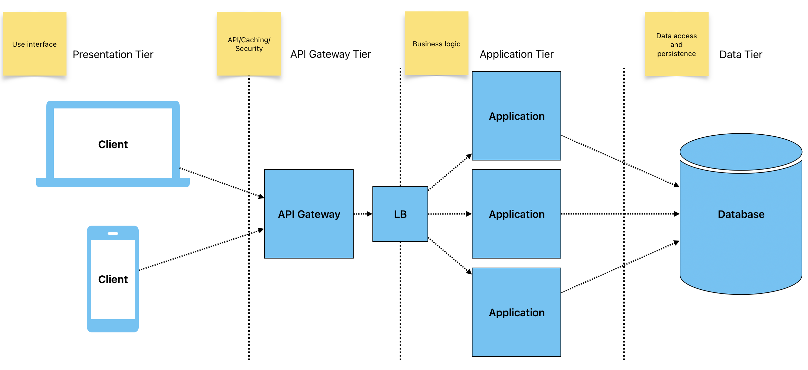

# Four-Tier Architecture

**Description**: Extends the three-tier architecture by adding a **Data Access Layer (DAL)** between the Logic Tier and the Data Tier.
- **Presentation Tier**: User interface.
- **API Gateway**: API/Caching/Security tier
- **Logic Tier**: Business logic.
- **Data Tier**: Database or data storage.

**Use Case**: Applications where data access logic needs to be decoupled from business logic for better scalability and security.

**Example**: Complex enterprise applications with extensive data handling requirements.

### Pros:
- **Modularity**: Enhanced separation of concerns by isolating data access logic.
- **Maintainability**: Easier to update and maintain data access logic without affecting other layers.
- **Scalability**: Improved scalability by isolating data-related operations.

### Cons:
- **Complexity**: Increased architectural complexity with the addition of API layer.
- **Performance**: Potential for added latency due to the additional API layer.

## Conclusion
Improved security by adding a layer for API/Caching/Security if compare to Three-Tier Architecture.