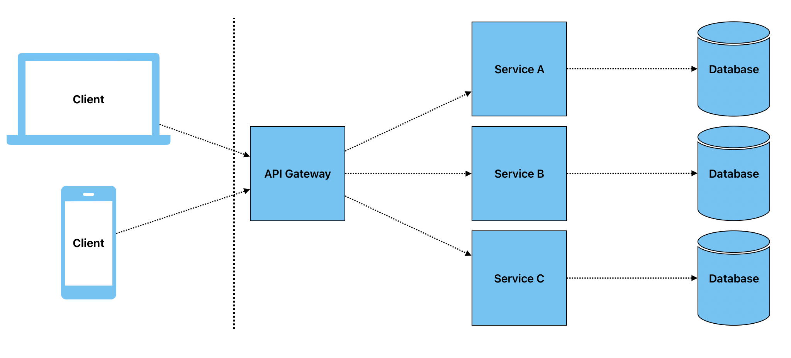

# Microservices Architecture

- **Description**: Microservices architecture is an approach where a single application is composed of multiple loosely coupled services. Each service is self-contained, responsible for a specific business capability, and can be developed, deployed, and scaled independently.
- **Use Case**: Complex, large-scale applications that require high scalability, flexibility, and resilience. Suitable for organizations that need to frequently update or scale parts of an application without affecting the entire system.
- **Example**: E-commerce platforms where different services handle user authentication, product catalog, order processing, and payment independently.

### Pros:
- **Scalability**: Each service can be scaled independently based on demand, optimizing resource usage.
- **Flexibility**: Services can be developed using different technologies, allowing teams to choose the best tools for each task.
- **Resilience**: Failure in one service does not necessarily bring down the entire application; other services can continue operating.
- **Deployment**: Independent deployment of services allows for continuous delivery and integration, reducing downtime and speeding up updates.

### Cons:
- **Complexity**: Managing multiple services can be challenging, especially in terms of deployment, monitoring, and debugging.
- **Communication**: Inter-service communication, often done via APIs or message queues, can introduce latency and require robust error handling.
- **Data Management**: Maintaining data consistency across services is complex, particularly in distributed systems.
- **Overhead**: The need for a robust infrastructure to manage, monitor, and secure multiple services can increase operational costs.

## Conclusion
Microservices architecture is ideal for large, complex applications requiring flexibility, scalability, and resilience. However, it introduces significant complexity in terms of development, deployment, and management, which can increase both operational overhead and the need for advanced technical expertise.

