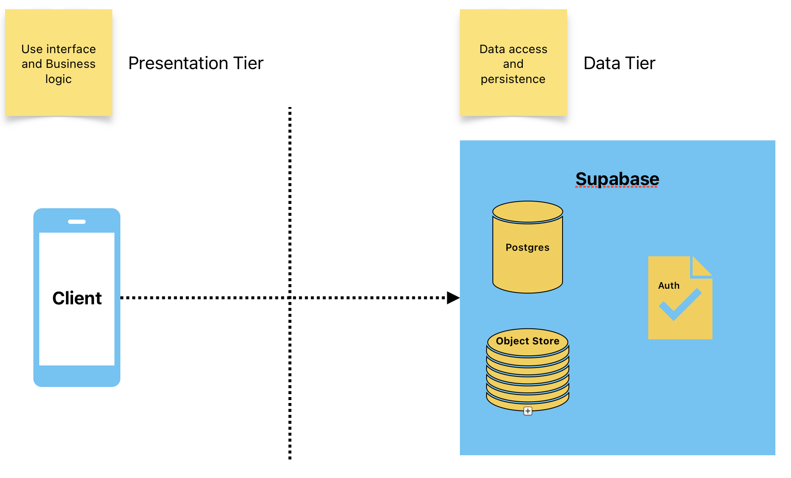

# Two-Tier Architecture

- **Description**: This involves a client-server model where the client (user interface) communicates directly with the server (database or application server).
- **Use Case**: Simple applications where business logic is minimal or embedded in the client-side application.
- **Example**: Desktop applications that directly access a database.

### Pros:
- **Simplicity**: Easy to develop and deploy.
- **Performance**: Direct communication between client and server can lead to faster response times in simple applications.

### Cons:
- **Scalability**: Difficult to scale as the client is tightly coupled with the server.
- **Maintainability**: Changes in business logic require updates to the client application.
- **Security**: Increased risk since the client interacts directly with the database.

## Conclusion
Two-tier architecture is suitable for simple applications with minimal business logic and direct access to the database. 
However, it may not be scalable or maintainable in the long run, and there is an increased security risk due to direct client-database interaction.